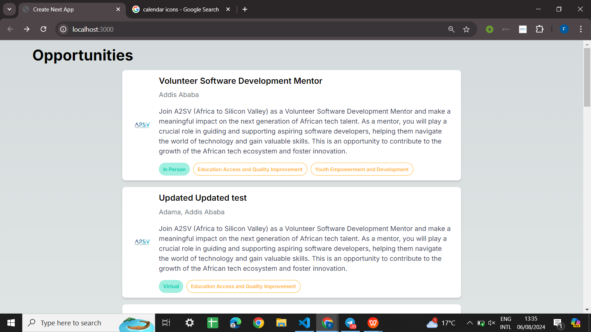
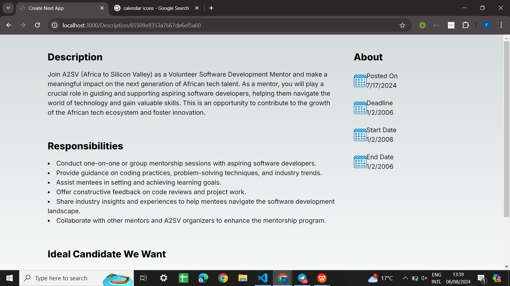

Job Listing Application

The Job Listing Application is a modern web application built using Next.js, React, TypeScript, and Tailwind CSS. This application fetches job data from a remote API endpoint and dynamically displays job listings with detailed descriptions, candidate requirements, and important dates. The goal is to provide a seamless and user-friendly experience for job seekers to find relevant opportunities and for employers to list their job openings efficiently.

Features
Dynamic Job Listings: Fetches and displays job data from a remote API endpoint, ensuring that the listings are always up-to-date.
Detailed Job Descriptions: Each job listing includes a comprehensive description, candidate requirements, and responsibilities.
Important Dates: Displays critical dates such as the posting date, application deadline, start date, and end date for each job.

