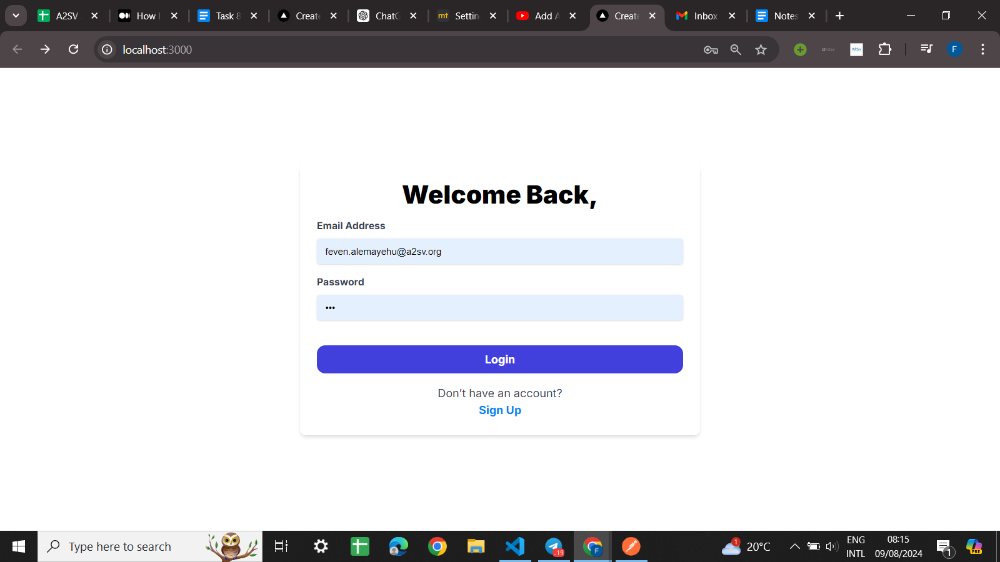
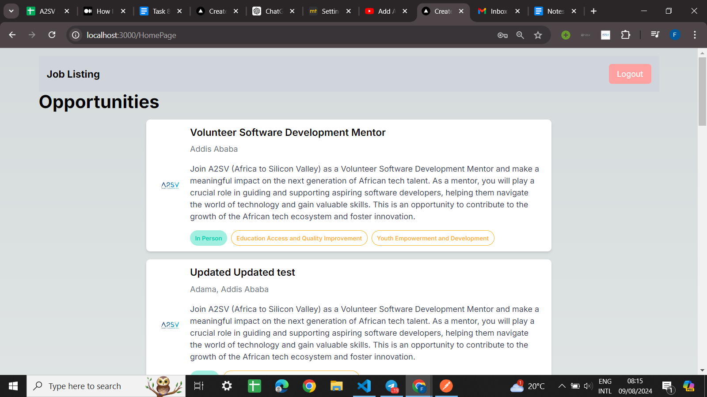
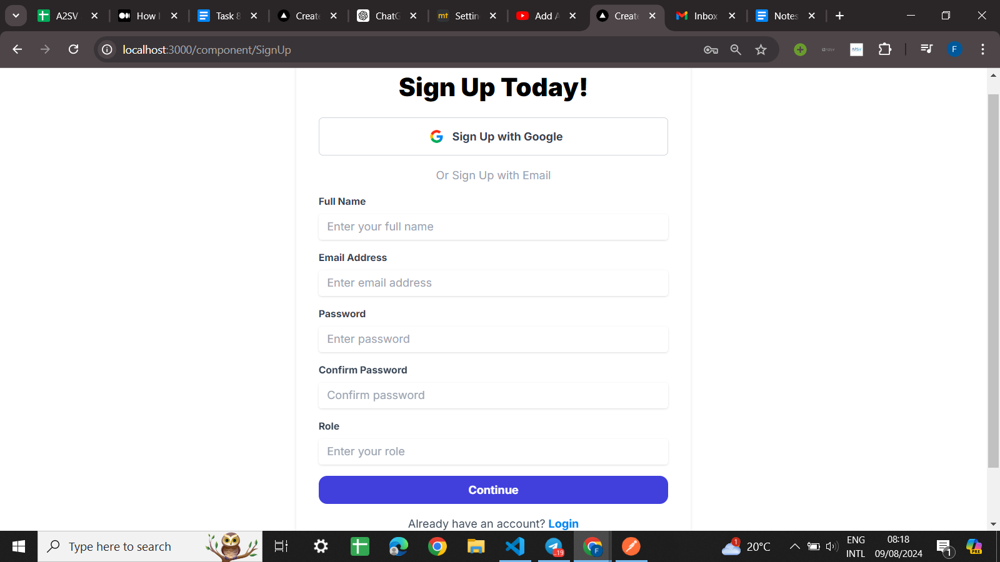

JOB LiSTING APPLICATION

Overview

This is a Job Listing Application built with React and Next.js and Tailwind. It provides users with the ability to view job opportunities, sign in, and sign out. The application utilizes NextAuth for authentication with Google Provider, and Axios for handling API requests.

when you hit the login and if you already have an account It will redirect you to the Job listing application homepage.

If you are a new user you can hit the signup and it will help you register and have an account
you can also use the google to signup

## Features

- **Job Listings**: Displays a list of job opportunities fetched from an external API.
- **Sign In**: Allows users to sign in using Google authentication.
- **Sign Out**: Allows users to sign out, clearing session data and redirecting to the login page.

## Technologies

- **React**: For building the user interface.
- **Next.js**: For server-side rendering and routing.
- **NextAuth**: For authentication and session management.
- **Axios**: For making HTTP requests.
- **Tailwind CSS**: For styling the application.
>>>>>>> d48097e (resolved merge conflicts)
